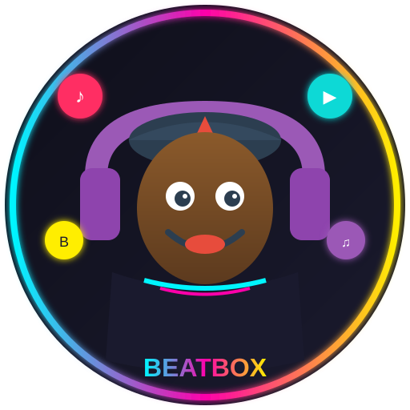

# SimpleIncredibox



Простое Android-приложение (игра) на Java, вдохновлённое [Incredibox](https://www.incredibox.com/).

## Описание

- Перетаскивайте иконки персонажей (звуков) на сцену.
- Каждый персонаж проигрывает свой зацикленный звук (бит, эффект, мелодия, голос).
- Можно комбинировать до 7 слотов одновременно.
- Нажмите на слот, чтобы убрать персонажа.

Это упрощённый прототип. Звуки генерируются программно через `ToneGenerator` (разные частоты). В реальном проекте замените на аудиофайлы из `res/raw`.

## Скачать готовый APK

Приложение **собирается автоматически** через GitHub Actions.

1. Перейди во вкладку **Actions**: https://github.com/adop1344-bot/SimpleIncredibox/actions
2. Выбери последний успешный workflow **Build APK**
3. Внизу страницы в секции **Artifacts** скачай **SimpleIncredibox-debug**
4. Распакуй zip → получишь `app-debug.apk`

Можно также запустить сборку вручную: Actions → Build APK → **Run workflow**.

## Аватарка / Иконка

Аватарка приложения лежит в корне репозитория: [`avatar.svg`](avatar.svg)

Также добавлен векторный drawable для launcher: `app/src/main/res/drawable/ic_launcher_foreground.xml`

## Структура проекта

Стандартный Android-проект:
- `app/src/main/java/com/example/simpleincredibox/` — Java-код
- `app/src/main/res/` — layout и ресурсы
- Gradle-файлы для сборки
- `.github/workflows/build-apk.yml` — автоматическая сборка APK

## Как собрать локально

1. Откройте проект в Android Studio.
2. Sync Gradle.
3. Запустите на эмуляторе или устройстве (minSdk 24).

Или:
```bash
./gradlew assembleDebug
```

APK будет в `app/build/outputs/apk/debug/`.

## Особенности реализации

- Drag & Drop через `OnDragListener` и `OnLongClickListener`.
- 4 типа звуков: Beat (низкий), Effect, Melody, Voice (высокий).
- Циклическое воспроизведение через `Handler` + `ToneGenerator`.
- Простой UI без сложных анимаций.

## Возможные улучшения

- Добавить реальные .ogg/.wav файлы в `res/raw` и использовать `SoundPool` или `MediaPlayer`.
- Анимации персонажей.
- Запись микса.
- Больше слотов и звуков.
- Тёмная тема / стиль Incredibox.

Создано с помощью Grok.
